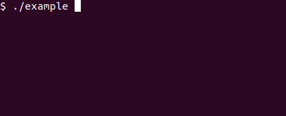
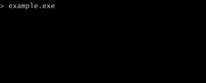

# Spinner

A simple, configurable, multi-platform terminal spinner. 

[](https://github.com/leaanthony/spinner/blob/master/LICENSE)

## Mac Demo


See the [Linux](#linux-demo) and [Windows](#windows-demo) demos.

Tested on:
  * Windows 10
  * MacOS 10.13.5
  * Ubuntu 18.04 LTS

## Installation

```
go get -u github.com/leaanthony/spinner
```

## Usage

### New Spinner

Spinners are created using New(message string), which takes a message to display.

```
  myspinner := spinner.New("Processing images")
```

### Starting the spinner

To start the spinner, simply call Start().

```
  myspinner := spinner.New("Processing images")
  myspinner.Start()
```

### Stop with Success 

To stop the spinner and indicate successful completion, call the Success(optionalMessage string) method. This will print a success symbol with the original message - all in green. If the optional string is given, it will be used instead of the original message.

```
  // Default
  myspinner := spinner.New("Processing images")
  myspinner.Start()
  time.Sleep(time.Second * 2)
  myspinner.Success()

  // Custom Message
  myspinner := spinner.New("Processing audio")
  myspinner.Start()
  time.Sleep(time.Second * 2)
  myspinner.Success("It took a while, but that was successful!")
```

### Stop with Error 

To stop the spinner and indicate an error, call the Error(optionalMessage string) method.
This has the same functionality as Success(), but will print an error symbol and it will all be in red.

```
  // Default
  myspinner := spinner.New("Processing images")
  myspinner.Start()
  time.Sleep(time.Second * 2)
  myspinner.Error()

  // Custom message
  myspinner := spinner.New("Processing audio")
  myspinner.Start()
  time.Sleep(time.Second * 2)
  myspinner.Error("Too many lolcats!")
```

### Success/Error using custom formatter

In addition to Success() and Error(), there is Successf() and Errorf(). Both take the same parameters: (format string, args ...interface{}). This is identical to fmt.Sprintf (which it uses under the hood). 

```
	// Formatted Success
	a = spinner.New("This is a formatted custom success message")
	a.Start()
	time.Sleep(time.Second * 2)
	spin := "Spinner"
	awesome := "Awesome"
	a.Successf("%s is %s!", spin, awesome)

	// Formatted Error
	a = spinner.New("This is a formatted custom error message")
	a.Start()
	secs := 2
	time.Sleep(time.Second * time.Duration(secs))
	a.Errorf("I waited %d seconds to error!", secs)
```

### Custom Success/Error Symbols

Both Success() and Error() use symbols (as well as colour) to indicate their status.
These symbols default to spaces on Windows and ✓ & ✗ on other (vt100 compatible) platforms. They can be set manually using the SetSuccessSymbol(symbol string) and SetErrorSymbol(symbol string) methods.

```
  myspinner := spinner.New("Processing images")

  // Custom symbols
  myspinner.SetErrorSymbol("💩")
  myspinner.SetSuccessSymbol("🏆")

  myspinner.Start()
  time.Sleep(time.Second * 2)
  myspinner.Error("It broke :(")
```

### Custom Spinner

By default, the spinner used is the spinning bar animation on Windows and the snake animation for other platforms. This can be customised using SetSpinFrames(frames []string). It takes a slice of strings defining the spinner symbols. 

```
  myspinner := spinner.New("Processing images")
  myspinner.SetSpinFrames([]string{"^", ">", "v", "<"})
  myspinner.Start()
  time.Sleep(time.Second * 2)
  myspinner.Success()
```

### Resuse Spinner

It's possible to reuse an existing spinner by calling the Restart(message string) method. This restarts the spinner with the given message.

```
  myspinner := spinner.New("Processing images")
  myspinner.SetSpinFrames([]string{"^", ">", "v", "<"})
  myspinner.Start()
  time.Sleep(time.Second * 2)
  myspinner.Success()

  myspinner.Restart("Spinner reuse!")
  time.Sleep(time.Second * 2)
  myspinner.Success()
```

## Rationale

I tried to find a simple, true cross platform spinner for Go that did what I wanted and couldn't find one. I'm sure they exist, but this was fun.

## Linux Demo


## Windows Demo


## With a little help from my friends

This project uses the awesome [Color] library. The code for handling windows cursor hiding and showing was split off into a different project ([wincursor])

[Color]: https://github.com/fatih/color
[wincursor]: https://github.com/leaanthony/wincursor

## Color license

The MIT License (MIT)

Copyright (c) 2013 Fatih Arslan

Permission is hereby granted, free of charge, to any person obtaining a copy of
this software and associated documentation files (the "Software"), to deal in
the Software without restriction, including without limitation the rights to
use, copy, modify, merge, publish, distribute, sublicense, and/or sell copies of
the Software, and to permit persons to whom the Software is furnished to do so,
subject to the following conditions:

The above copyright notice and this permission notice shall be included in all
copies or substantial portions of the Software.

THE SOFTWARE IS PROVIDED "AS IS", WITHOUT WARRANTY OF ANY KIND, EXPRESS OR
IMPLIED, INCLUDING BUT NOT LIMITED TO THE WARRANTIES OF MERCHANTABILITY, FITNESS
FOR A PARTICULAR PURPOSE AND NONINFRINGEMENT. IN NO EVENT SHALL THE AUTHORS OR
COPYRIGHT HOLDERS BE LIABLE FOR ANY CLAIM, DAMAGES OR OTHER LIABILITY, WHETHER
IN AN ACTION OF CONTRACT, TORT OR OTHERWISE, ARISING FROM, OUT OF OR IN
CONNECTION WITH THE SOFTWARE OR THE USE OR OTHER DEALINGS IN THE SOFTWARE.
